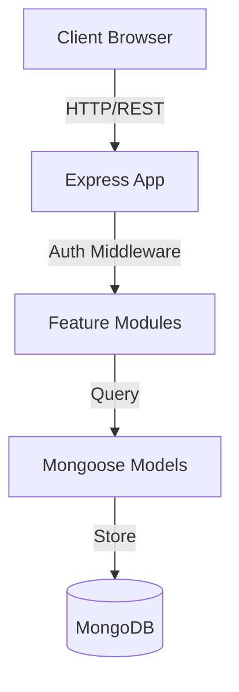

# Vishwa Patrakar Mahasangh - System Architecture

This document describes the architectural design and structural patterns of the Vishwa Patrakar Mahasangh web platform.

## Architectural Paradigm: Modular Monolith

The application is structured as a **Modular Monolith**, separating concerns between a React + TypeScript frontend and a Node.js + Express backend inside a unified workspace. This design guarantees high cohesion, low coupling, and scalable maintenance.

---

## Backend Architecture

The backend code is localized inside `backend/src/` with a modular organizational design:

1. **Centralized Data Models**: Database schemas are centralized in `backend/src/models/` (`User.js`, `OTP.js`, `AuditLog.js`) to guarantee reuse and prevent circular dependency loops between modular services.
2. **Modular Business Domains**: Endpoint definitions, controllers, and services are grouped by domain under `backend/src/modules/`:
   - `auth/`: Handle OTP validation, login validation, and profile management.
   - `admin/`: Audit logs, system stats, and member list lookups.
   - `member/`: Public search directory queries.
   - `payment/`: Submission and checking of payment receipts.
3. **Layer Separation**:
   - **Routes**: Handle request endpoints and link middlewares (rate limiters, uploads, authentication).
   - **Controllers**: Thin controllers mapping raw HTTP requests to service methods and writing responses.
   - **Services**: Pure business logic services containing database interactions.

---

## Frontend Architecture

The frontend is a modern SPA powered by React, TypeScript, and Vite. It is organized inside the `frontend/src/` folder:

1. **Feature-based Folders**: All UI pages, feature-specific components, layouts, and styles are grouped under `src/features/` by domain, removing the generic pages folder.
2. **Central Shared Components**: Generic layouts (`Layout.tsx`, `Navbar.tsx`, `Footer.tsx`) reside under `src/components/common/`, while raw dynamic UI elements (`Tilt.tsx`, `GlobeCanvas.tsx`) reside in `src/components/ui/`.
3. **Split API Layer**: Client API hooks and definitions are split under `src/api/` into module files (`auth.api.ts`, `member.api.ts`, `payment.api.ts`, `admin.api.ts`) and re-exported centrally from `src/api/index.ts`.
4. **Path Aliasing**: The code uses Vite path aliasing (`@/` resolving to `src/`) to eliminate fragile, deeply nested relative paths (e.g. `../../../../`).
